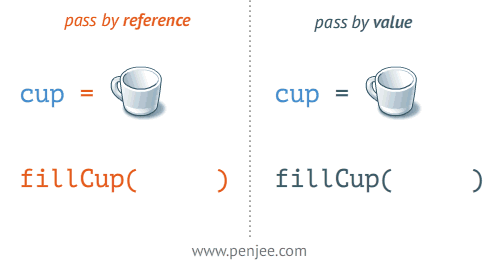

## Pass by value and Pass by reference



In python, it is neither `pass-by-value` nor `pass-by-reference`, Arguments are `passed-by-assignment` (or We can say Python **`passes reference to object by value`** or we can say ***it is "pass by value" but all values are just references to objects.***)

So there are two aspect of this,

1. the parameter passed in is actually a reference to an object (but the reference is passed by value)
2. some data types are mutable, but others aren't

Broadly speaking,

- If you pass a mutable object into a method (function defined for that object, or simply function), the method gets a reference to that same object and you can mutate it to your heart's delight, but if you rebind the reference in the method, the outer scope will know nothing about it, and after you're done, the outer reference will still point at the original object.
- If you pass an immutable object to a method, you still can't rebind the outer reference, and you can't even mutate the object.

Let's at first check these cases for a mutable type, **List**


```python
def try_to_change_list_contents(the_list):
    print('got', the_list)
    the_list.append(4)
    print('changed to', the_list)

outer_list = [1, 2, 3]

print('before, outer_list =', outer_list)
try_to_change_list_contents(outer_list)
print('after, outer_list =', outer_list)
```

    before, outer_list = [1, 2, 3]
    got [1, 2, 3]
    changed to [1, 2, 3, 4]
    after, outer_list = [1, 2, 3, 4]
    


```python
def try_to_change_list_contents(the_list):
    print('got', the_list)
    new_list = the_list
    new_list.append(5)
    print('new_list', new_list)
    print('the_list', the_list)

outer_list = [1, 2, 3]

print('before, outer_list =', outer_list)
try_to_change_list_contents(outer_list)
print('after, outer_list =', outer_list)
```

    before, outer_list = [1, 2, 3]
    got [1, 2, 3]
    new_list [1, 2, 3, 5]
    the_list [1, 2, 3, 5]
    after, outer_list = [1, 2, 3, 5]
    

Since the parameter-passed-in, `the_list`, is a reference to `outer_list`, not a copy of it, we can use the mutating list methods to change it and have the changes reflected in the outer scope.

**Now let's see what happens when we try to change the reference that was passed in as a parameter to the function**


```python
def try_to_change_list_contents(the_list):
    print('got', the_list)
    the_list = [5, 6, 7]
    print('changed to', the_list)

outer_list = [1, 2, 3]

print('before, outer_list =', outer_list)
try_to_change_list_contents(outer_list)
print('after, outer_list =', outer_list)
```

    before, outer_list = [1, 2, 3]
    got [1, 2, 3]
    changed to [5, 6, 7]
    after, outer_list = [1, 2, 3]
    

Since the `the_list` parameter (*a reference to a mutable object*) was **passed by value**, assigning a new list to it had no effect that the code outside the method could see. The `the_list` was a copy of the outer_list reference (since it was passed by value), and we had `the_list` point to a new list, but there was no way to change where `outer_list` pointed.

Now for **String - an immutable type**


```python
def try_to_change_string_reference(the_string):
    print('got', the_string)
    the_string = 'In a kingdom by the sea'
    print('set to', the_string)

outer_string = 'It was many and many a year ago'

print('before, outer_string =', outer_string)
try_to_change_string_reference(outer_string)
print('after, outer_string =', outer_string)
```

    before, outer_string = It was many and many a year ago
    got It was many and many a year ago
    set to In a kingdom by the sea
    after, outer_string = It was many and many a year ago
    

Again, since the `the_string` parameter (a reference to an immuatable object) was passed by value, assigning a new string to it had no effect that the code outside the method could see. The `the_string` was a copy of the `outer_string` reference, and we had `the_string` point to a new string, but there was no way to change where outer_string pointed.

**So How do we pass-by-reference the immutable objects like tuples, string, numbers**

The simplest way is to wrap the immutable object with mutable object like list then pass it the function. The following exmaple shows this,


```python
def inc_num(num):
    num += 1
    print(f"num from function is {num}")
    
num = 0

inc_num(num)

print(f"num from outside the function is {num}")
```

    num from function is 1
    num from outside the function is 0
    

`num` doesn't change here, because `num` is immutable, so when the reference is passed (by-value) of the num, since it cannot be mutated, a copy is created while increased and the outside object remains unchanged.

But we can pass it by reference by wraping the `num` with list.


```python
def inc_num(num):
    num[0] += 1
    print(f"num from function is {num[0]}")

num = 0

inc_num([num])

print(f"num from outside the function is {num}")
```

    num from function is 1
    num from outside the function is 0
    

## More and Reaalllyyy More on this topic

- [How do I pass a variable by reference?](https://stackoverflow.com/questions/986006/how-do-i-pass-a-variable-by-reference)
- [Passing values in Python](https://stackoverflow.com/questions/534375/passing-values-in-python)

## How to pass by value an mutable object

Well, by passing a copy of it


```python
def try_to_change_list_contents(the_list):
    print('got', the_list)
    the_list.append(4)
    print('changed to', the_list)

outer_list = [1, 2, 3]

print('before, outer_list =', outer_list)
try_to_change_list_contents(outer_list.copy()) # passing the reference to the copied verison
print('after, outer_list =', outer_list) # so original version remain the same.v
```

    before, outer_list = [1, 2, 3]
    got [1, 2, 3]
    changed to [1, 2, 3, 4]
    after, outer_list = [1, 2, 3]
    

**And lastly, in python, instead of thinking in terms of variables and values, it would be better to think in terms of names and objects**

- Python has names and objects.
- Assignment binds a name to an object.
